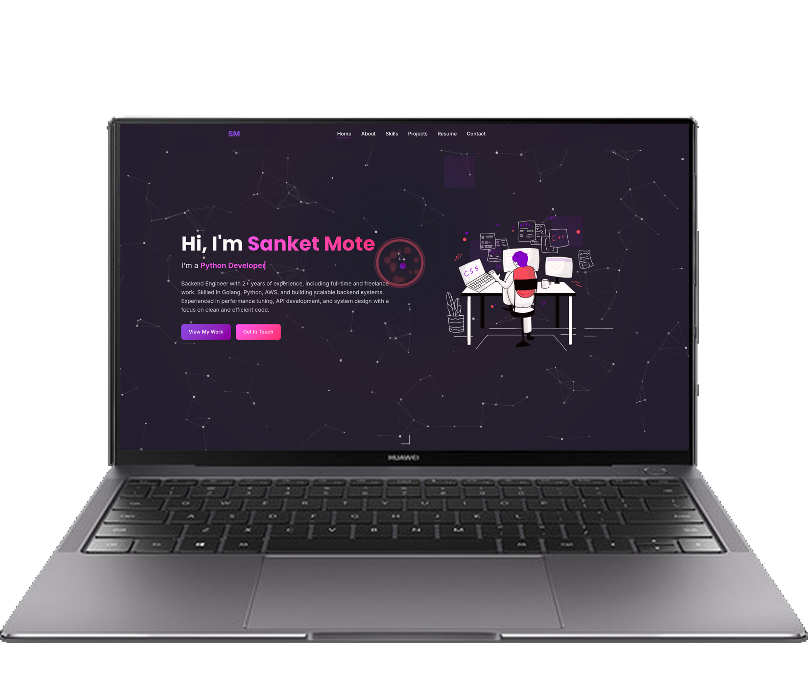

<h1 align="center">Personal Portfolio website</h1>

<!-- TABLE OF CONTENTS -->
## Table of Contents

* [About the Project](#about-the-project)
* [Built With](#built-with)
* [Features](#Features)
* [Section](#Section)
* [Author](#Author)

<!-- ABOUT THE PROJECT -->
## About The Project

This project represents my personal Portfolio and features some of my github projects

## Built With
This project built using 
* HTML5
* CSS3
* JavaScript
* Bootstrap

## Features
* Fully Responsive
* Attractive

## Section

✔️ A little about Me

✔️ Certifications

✔️ What I’m good at

✔️ Projects

✔️ Extracurricular

✔️ Let's Connect

<!-- LIVE VERSION -->
## Live version

You can see it [here]( http://smresume.byethost33.com/)

## Author
# Sanket Mote 

